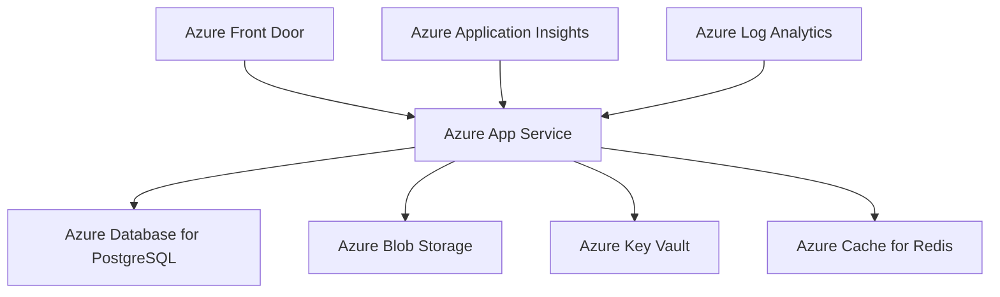

# PrepMyCert - Azure Cloud Deployment Guide

> **Complete deployment guide for deploying PrepMyCert Flask application to Microsoft Azure**

## 📋 Table of Contents

1. [Prerequisites](#prerequisites)
2. [Architecture Overview](#architecture-overview)
3. [Azure Resources Setup](#azure-resources-setup)
4. [Environment Configuration](#environment-configuration)
5. [Database Setup](#database-setup)
6. [Application Deployment](#application-deployment)
7. [Domain and SSL Configuration](#domain-and-ssl-configuration)
8. [Monitoring and Logging](#monitoring-and-logging)
9. [Scaling and Performance](#scaling-and-performance)
10. [Security Best Practices](#security-best-practices)
11. [Backup and Disaster Recovery](#backup-and-disaster-recovery)
12. [Troubleshooting](#troubleshooting)
13. [Cost Optimization](#cost-optimization)

---

## Prerequisites

### Required Tools and Accounts
- **Azure Account** with active subscription
- **Azure CLI** installed and configured
- **Git** for version control
- **Python 3.12+** for local testing
- **Stripe Account** for payment processing
- **Domain Name** (optional, for custom domain)

### Local Environment Setup
```bash
# Install Azure CLI (Windows)
winget install Microsoft.AzureCLI

# Or via pip
pip install azure-cli

# Login to Azure
az login

# Verify subscription
az account show
```

---

## Architecture Overview

### Azure Services Used



**Core Services:**
- **Azure App Service** - Flask application hosting
- **Azure Database for PostgreSQL** - Managed database
- **Azure Blob Storage** - Image and static file storage
- **Azure Key Vault** - Secure configuration management
- **Azure Application Insights** - Application monitoring
- **Azure Cache for Redis** - Session and rate limiting storage

---

## Azure Resources Setup

### 1. Create Resource Group

```bash
# Set variables
RESOURCE_GROUP="prepmycert-rg"
LOCATION="East US"
APP_NAME="prepmycert-app"
DB_SERVER_NAME="prepmycert-db-server"
STORAGE_ACCOUNT="prepmycertstorage"

# Create resource group
az group create \
  --name $RESOURCE_GROUP \
  --location "$LOCATION"
```

### 2. Create Azure Database for PostgreSQL

```bash
# Create PostgreSQL flexible server
az postgres flexible-server create \
  --resource-group $RESOURCE_GROUP \
  --name $DB_SERVER_NAME \
  --location "$LOCATION" \
  --admin-user prepmycertadmin \
  --admin-password "YourSecurePassword123!" \
  --sku-name Standard_B1ms \
  --tier Burstable \
  --public-access 0.0.0.0 \
  --storage-size 32 \
  --version 14

# Create database
az postgres flexible-server db create \
  --resource-group $RESOURCE_GROUP \
  --server-name $DB_SERVER_NAME \
  --database-name prepmycert
```

### 3. Create Azure Storage Account

```bash
# Create storage account
az storage account create \
  --name $STORAGE_ACCOUNT \
  --resource-group $RESOURCE_GROUP \
  --location "$LOCATION" \
  --sku Standard_LRS \
  --kind StorageV2

# Create blob container for images
az storage container create \
  --name certification-images \
  --account-name $STORAGE_ACCOUNT \
  --public-access blob
```

### 4. Create Azure Key Vault

```bash
# Create Key Vault
az keyvault create \
  --name "prepmycert-keyvault" \
  --resource-group $RESOURCE_GROUP \
  --location "$LOCATION" \
  --sku standard
```

### 5. Create Azure App Service

```bash
# Create App Service Plan
az appservice plan create \
  --name "prepmycert-plan" \
  --resource-group $RESOURCE_GROUP \
  --location "$LOCATION" \
  --sku P1V3 \
  --is-linux

# Create Web App
az webapp create \
  --resource-group $RESOURCE_GROUP \
  --plan "prepmycert-plan" \
  --name $APP_NAME \
  --runtime "PYTHON:3.12" \
  --deployment-local-git
```

### 6. Create Application Insights

```bash
# Create Application Insights
az monitor app-insights component create \
  --app prepmycert-insights \
  --location "$LOCATION" \
  --resource-group $RESOURCE_GROUP \
  --kind web
```

---

## Environment Configuration

### Azure Key Vault Secrets

```bash
# Database configuration
az keyvault secret set \
  --vault-name "prepmycert-keyvault" \
  --name "DATABASE-URL" \
  --value "postgresql://prepmycertadmin:YourSecurePassword123!@${DB_SERVER_NAME}.postgres.database.azure.com:5432/prepmycert"

# Session secret
az keyvault secret set \
  --vault-name "prepmycert-keyvault" \
  --name "SESSION-SECRET" \
  --value "$(openssl rand -hex 32)"

# Stripe configuration
az keyvault secret set \
  --vault-name "prepmycert-keyvault" \
  --name "STRIPE-SECRET-KEY" \
  --value "sk_live_your_stripe_secret_key"

az keyvault secret set \
  --vault-name "prepmycert-keyvault" \
  --name "STRIPE-PUBLISHABLE-KEY" \
  --value "pk_live_your_stripe_publishable_key"

# Azure Storage
STORAGE_CONNECTION_STRING=$(az storage account show-connection-string \
  --resource-group $RESOURCE_GROUP \
  --name $STORAGE_ACCOUNT \
  --query connectionString -o tsv)

az keyvault secret set \
  --vault-name "prepmycert-keyvault" \
  --name "AZURE-STORAGE-CONNECTION-STRING" \
  --value "$STORAGE_CONNECTION_STRING"

# Email configuration (example with SendGrid)
az keyvault secret set \
  --vault-name "prepmycert-keyvault" \
  --name "MAIL-SERVER" \
  --value "smtp.sendgrid.net"

az keyvault secret set \
  --vault-name "prepmycert-keyvault" \
  --name "MAIL-USERNAME" \
  --value "apikey"

az keyvault secret set \
  --vault-name "prepmycert-keyvault" \
  --name "MAIL-PASSWORD" \
  --value "your_sendgrid_api_key"

# Admin user configuration
az keyvault secret set \
  --vault-name "prepmycert-keyvault" \
  --name "ADMIN-EMAIL" \
  --value "admin@prepmycert.com"

az keyvault secret set \
  --vault-name "prepmycert-keyvault" \
  --name "ADMIN-PASSWORD" \
  --value "SecureAdminPassword123!"
```

### App Service Configuration

```bash
# Configure Key Vault references
az webapp config appsettings set \
  --resource-group $RESOURCE_GROUP \
  --name $APP_NAME \
  --settings \
    DATABASE_URL="@Microsoft.KeyVault(VaultName=prepmycert-keyvault;SecretName=DATABASE-URL)" \
    SESSION_SECRET="@Microsoft.KeyVault(VaultName=prepmycert-keyvault;SecretName=SESSION-SECRET)" \
    STRIPE_SECRET_KEY="@Microsoft.KeyVault(VaultName=prepmycert-keyvault;SecretName=STRIPE-SECRET-KEY)" \
    STRIPE_PUBLISHABLE_KEY="@Microsoft.KeyVault(VaultName=prepmycert-keyvault;SecretName=STRIPE-PUBLISHABLE-KEY)" \
    AZURE_STORAGE_CONNECTION_STRING="@Microsoft.KeyVault(VaultName=prepmycert-keyvault;SecretName=AZURE-STORAGE-CONNECTION-STRING)" \
    MAIL_SERVER="@Microsoft.KeyVault(VaultName=prepmycert-keyvault;SecretName=MAIL-SERVER)" \
    MAIL_USERNAME="@Microsoft.KeyVault(VaultName=prepmycert-keyvault;SecretName=MAIL-USERNAME)" \
    MAIL_PASSWORD="@Microsoft.KeyVault(VaultName=prepmycert-keyvault;SecretName=MAIL-PASSWORD)" \
    ADMIN_EMAIL="@Microsoft.KeyVault(VaultName=prepmycert-keyvault;SecretName=ADMIN-EMAIL)" \
    ADMIN_PASSWORD="@Microsoft.KeyVault(VaultName=prepmycert-keyvault;SecretName=ADMIN-PASSWORD)"

# Additional configuration
az webapp config appsettings set \
  --resource-group $RESOURCE_GROUP \
  --name $APP_NAME \
  --settings \
    FLASK_ENV="production" \
    FLASK_DEBUG="False" \
    MAIL_PORT="587" \
    MAIL_USE_TLS="True" \
    MAIL_USE_SSL="False" \
    MAIL_DEFAULT_SENDER="noreply@prepmycert.com" \
    MAIL_SUPPRESS_SEND="False" \
    AZURE_CONTAINER_NAME="certification-images" \
    AZURE_STORAGE_ACCOUNT_NAME="$STORAGE_ACCOUNT" \
    AZURE_BLOB_BASE_URL="https://${STORAGE_ACCOUNT}.blob.core.windows.net/certification-images"
```

### Grant App Service Access to Key Vault

```bash
# Enable managed identity for App Service
az webapp identity assign \
  --resource-group $RESOURCE_GROUP \
  --name $APP_NAME

# Get the managed identity principal ID
PRINCIPAL_ID=$(az webapp identity show \
  --resource-group $RESOURCE_GROUP \
  --name $APP_NAME \
  --query principalId -o tsv)

# Grant access to Key Vault
az keyvault set-policy \
  --name "prepmycert-keyvault" \
  --object-id $PRINCIPAL_ID \
  --secret-permissions get list
```

---

## Database Setup

### 1. Configure Firewall Rules

```bash
# Allow Azure services
az postgres flexible-server firewall-rule create \
  --resource-group $RESOURCE_GROUP \
  --name $DB_SERVER_NAME \
  --rule-name AllowAzureServices \
  --start-ip-address 0.0.0.0 \
  --end-ip-address 0.0.0.0

# Allow your current IP for management
YOUR_IP=$(curl -s https://api.ipify.org)
az postgres flexible-server firewall-rule create \
  --resource-group $RESOURCE_GROUP \
  --name $DB_SERVER_NAME \
  --rule-name AllowMyIP \
  --start-ip-address $YOUR_IP \
  --end-ip-address $YOUR_IP
```

### 2. Database Migration

```bash
# Connect to the database and run migrations
# Option 1: Using local migration script
python migrate_database.py

# Option 2: Connect via psql and run SQL
psql "host=${DB_SERVER_NAME}.postgres.database.azure.com port=5432 dbname=prepmycert user=prepmycertadmin password=YourSecurePassword123! sslmode=require"
```

---

## Application Deployment

### 1. Prepare Application for Production

Create `startup.sh` in your project root:

```bash
#!/bin/bash

# startup.sh - Azure App Service startup script
echo "Starting PrepMyCert application..."

# Install dependencies
pip install -r requirements.txt

# Run database migrations
python migrate_database.py

# Start the application with Gunicorn
gunicorn --bind=0.0.0.0:8000 --timeout 600 --workers 4 main:app
```

### 2. Configure Azure App Service Startup

```bash
# Set startup command
az webapp config set \
  --resource-group $RESOURCE_GROUP \
  --name $APP_NAME \
  --startup-file "startup.sh"

# Configure Python version and other settings
az webapp config set \
  --resource-group $RESOURCE_GROUP \
  --name $APP_NAME \
  --linux-fx-version "PYTHON|3.12"
```

### 3. Deploy via Git

```bash
# Add Azure remote
git remote add azure https://$APP_NAME.scm.azurewebsites.net:443/$APP_NAME.git

# Deploy to Azure
git push azure main
```

### 4. Alternative: Deploy via Azure DevOps

Create `azure-pipelines.yml`:

```yaml
trigger:
- main

pool:
  vmImage: 'ubuntu-latest'

variables:
  pythonVersion: '3.12'

steps:
- task: UsePythonVersion@0
  inputs:
    versionSpec: '$(pythonVersion)'
  displayName: 'Use Python $(pythonVersion)'

- script: |
    python -m venv antenv
    source antenv/bin/activate
    python -m pip install --upgrade pip
    pip install -r requirements.txt
  displayName: 'Install dependencies'

- task: ArchiveFiles@2
  displayName: 'Archive files'
  inputs:
    rootFolderOrFile: '$(System.DefaultWorkingDirectory)'
    includeRootFolder: false
    archiveType: zip
    archiveFile: $(Build.ArtifactStagingDirectory)/$(Build.BuildId).zip
    replaceExistingArchive: true

- task: PublishBuildArtifacts@1
  inputs:
    PathtoPublish: '$(Build.ArtifactStagingDirectory)'
    ArtifactName: 'drop'
    publishLocation: 'Container'

- task: AzureWebApp@1
  displayName: 'Deploy Azure Web App'
  inputs:
    azureSubscription: 'your-service-connection'
    appType: 'webAppLinux'
    appName: '$(APP_NAME)'
    package: '$(Build.ArtifactStagingDirectory)/$(Build.BuildId).zip'
```

---

## Domain and SSL Configuration

### 1. Custom Domain Setup

```bash
# Add custom domain
az webapp config hostname add \
  --webapp-name $APP_NAME \
  --resource-group $RESOURCE_GROUP \
  --hostname "www.prepmycert.com"

# Verify domain ownership (follow Azure portal instructions)
```

### 2. SSL Certificate

```bash
# Option 1: Free App Service Managed Certificate
az webapp config ssl bind \
  --certificate-type Managed \
  --name $APP_NAME \
  --resource-group $RESOURCE_GROUP \
  --ssl-type SNI

# Option 2: Upload custom certificate
az webapp config ssl upload \
  --certificate-file /path/to/certificate.pfx \
  --certificate-password "certificate-password" \
  --name $APP_NAME \
  --resource-group $RESOURCE_GROUP
```

---

## Monitoring and Logging

### 1. Application Insights Configuration

```bash
# Get Application Insights instrumentation key
INSTRUMENTATION_KEY=$(az monitor app-insights component show \
  --app prepmycert-insights \
  --resource-group $RESOURCE_GROUP \
  --query instrumentationKey -o tsv)

# Configure Application Insights
az webapp config appsettings set \
  --resource-group $RESOURCE_GROUP \
  --name $APP_NAME \
  --settings \
    APPINSIGHTS_INSTRUMENTATIONKEY="$INSTRUMENTATION_KEY" \
    APPLICATIONINSIGHTS_CONNECTION_STRING="InstrumentationKey=$INSTRUMENTATION_KEY"
```

### 2. Enable Application Logging

```bash
# Enable application logging
az webapp log config \
  --resource-group $RESOURCE_GROUP \
  --name $APP_NAME \
  --application-logging filesystem \
  --level information

# Enable web server logging
az webapp log config \
  --resource-group $RESOURCE_GROUP \
  --name $APP_NAME \
  --web-server-logging filesystem
```

### 3. Log Analytics Workspace

```bash
# Create Log Analytics Workspace
az monitor log-analytics workspace create \
  --resource-group $RESOURCE_GROUP \
  --workspace-name "prepmycert-logs" \
  --location "$LOCATION"

# Connect Application Insights to Log Analytics
WORKSPACE_ID=$(az monitor log-analytics workspace show \
  --resource-group $RESOURCE_GROUP \
  --workspace-name "prepmycert-logs" \
  --query customerId -o tsv)

az monitor app-insights component update \
  --app prepmycert-insights \
  --resource-group $RESOURCE_GROUP \
  --workspace $WORKSPACE_ID
```

---

## Scaling and Performance

### 1. Auto Scaling Configuration

```bash
# Configure auto-scaling rules
az monitor autoscale create \
  --resource-group $RESOURCE_GROUP \
  --resource /subscriptions/{subscription-id}/resourceGroups/$RESOURCE_GROUP/providers/Microsoft.Web/serverfarms/prepmycert-plan \
  --name prepmycert-autoscale \
  --min-count 2 \
  --max-count 10 \
  --count 2

# Add scaling rule based on CPU
az monitor autoscale rule create \
  --resource-group $RESOURCE_GROUP \
  --autoscale-name prepmycert-autoscale \
  --condition "Percentage CPU > 75 avg 10m" \
  --scale out 2

az monitor autoscale rule create \
  --resource-group $RESOURCE_GROUP \
  --autoscale-name prepmycert-autoscale \
  --condition "Percentage CPU < 25 avg 10m" \
  --scale in 1
```

### 2. Redis Cache for Sessions and Rate Limiting

```bash
# Create Redis Cache
az redis create \
  --location "$LOCATION" \
  --resource-group $RESOURCE_GROUP \
  --name prepmycert-redis \
  --sku Basic \
  --vm-size c0

# Get Redis connection string
REDIS_CONNECTION=$(az redis list-keys \
  --resource-group $RESOURCE_GROUP \
  --name prepmycert-redis \
  --query primaryConnectionString -o tsv)

# Update app settings
az webapp config appsettings set \
  --resource-group $RESOURCE_GROUP \
  --name $APP_NAME \
  --settings \
    REDIS_URL="$REDIS_CONNECTION"
```

---

## Security Best Practices

### 1. Network Security

```bash
# Restrict database access to App Service
az postgres flexible-server firewall-rule delete \
  --resource-group $RESOURCE_GROUP \
  --name $DB_SERVER_NAME \
  --rule-name AllowAll

# Use VNet integration (Premium plans)
az network vnet create \
  --resource-group $RESOURCE_GROUP \
  --name prepmycert-vnet \
  --address-prefix 10.0.0.0/16 \
  --subnet-name app-subnet \
  --subnet-prefix 10.0.1.0/24

az webapp vnet-integration add \
  --resource-group $RESOURCE_GROUP \
  --name $APP_NAME \
  --vnet prepmycert-vnet \
  --subnet app-subnet
```

### 2. Security Headers

Add to your Flask application:

```python
# In app.py, add security headers
@app.after_request
def after_request(response):
    response.headers['X-Content-Type-Options'] = 'nosniff'
    response.headers['X-Frame-Options'] = 'DENY'
    response.headers['X-XSS-Protection'] = '1; mode=block'
    response.headers['Strict-Transport-Security'] = 'max-age=31536000; includeSubDomains'
    response.headers['Content-Security-Policy'] = "default-src 'self'; script-src 'self' 'unsafe-inline' https://js.stripe.com; style-src 'self' 'unsafe-inline' https://cdnjs.cloudflare.com; img-src 'self' data: https://*.blob.core.windows.net"
    return response
```

### 3. Private Endpoints

```bash
# Create private endpoint for database
az network private-endpoint create \
  --resource-group $RESOURCE_GROUP \
  --name prepmycert-db-pe \
  --vnet-name prepmycert-vnet \
  --subnet app-subnet \
  --private-connection-resource-id "/subscriptions/{subscription}/resourceGroups/$RESOURCE_GROUP/providers/Microsoft.DBforPostgreSQL/flexibleServers/$DB_SERVER_NAME" \
  --connection-name db-connection \
  --group-ids postgresqlServer
```

---

## Backup and Disaster Recovery

### 1. Database Backup

```bash
# Enable automated backups (already enabled by default)
az postgres flexible-server show \
  --resource-group $RESOURCE_GROUP \
  --name $DB_SERVER_NAME \
  --query "backup"

# Create manual backup
az postgres flexible-server backup create \
  --resource-group $RESOURCE_GROUP \
  --name $DB_SERVER_NAME \
  --backup-name "manual-backup-$(date +%Y%m%d)"
```

### 2. App Service Backup

```bash
# Create storage account for backups
az storage account create \
  --name prepmycertbackup \
  --resource-group $RESOURCE_GROUP \
  --location "$LOCATION" \
  --sku Standard_GRS

# Configure backup
az webapp config backup create \
  --resource-group $RESOURCE_GROUP \
  --webapp-name $APP_NAME \
  --backup-name "daily-backup" \
  --storage-account-url "https://prepmycertbackup.blob.core.windows.net/backups" \
  --frequency 1d \
  --retain-one true \
  --retention-period-in-days 30
```

---

## Troubleshooting

### Common Issues and Solutions

#### 1. Application Won't Start
```bash
# Check application logs
az webapp log tail \
  --resource-group $RESOURCE_GROUP \
  --name $APP_NAME

# Check startup script
az webapp log download \
  --resource-group $RESOURCE_GROUP \
  --name $APP_NAME
```

#### 2. Database Connection Issues
```bash
# Test database connectivity
az postgres flexible-server connect \
  --name $DB_SERVER_NAME \
  --username prepmycertadmin \
  --database prepmycert

# Check firewall rules
az postgres flexible-server firewall-rule list \
  --resource-group $RESOURCE_GROUP \
  --name $DB_SERVER_NAME
```

#### 3. SSL Certificate Issues
```bash
# Check SSL binding
az webapp config ssl list \
  --resource-group $RESOURCE_GROUP

# Verify custom domain
az webapp config hostname list \
  --resource-group $RESOURCE_GROUP \
  --webapp-name $APP_NAME
```

#### 4. Performance Issues
```bash
# Check App Service metrics
az monitor metrics list \
  --resource "/subscriptions/{subscription}/resourceGroups/$RESOURCE_GROUP/providers/Microsoft.Web/sites/$APP_NAME" \
  --metric "CpuPercentage,MemoryPercentage,Http2xx,Http4xx,Http5xx" \
  --interval PT1M

# Scale up if needed
az appservice plan update \
  --resource-group $RESOURCE_GROUP \
  --name "prepmycert-plan" \
  --sku P2V3
```

---

## Cost Optimization

### 1. Right-sizing Resources

```bash
# Monitor costs
az consumption budget list \
  --scope "/subscriptions/{subscription-id}/resourceGroups/$RESOURCE_GROUP"

# Optimize App Service Plan
# Start with Basic B1, scale as needed
az appservice plan update \
  --resource-group $RESOURCE_GROUP \
  --name "prepmycert-plan" \
  --sku B1

# Use Reserved Instances for predictable workloads
az reservations reservation-order purchase \
  --reserved-resource-type VirtualMachines \
  --sku Standard_D2s_v3 \
  --term P1Y \
  --quantity 1
```

### 2. Storage Optimization

```bash
# Use appropriate storage tiers
az storage account update \
  --name $STORAGE_ACCOUNT \
  --resource-group $RESOURCE_GROUP \
  --access-tier Cool  # For infrequently accessed data
```

### 3. Monitoring and Alerts

```bash
# Create budget alert
az consumption budget create \
  --resource-group $RESOURCE_GROUP \
  --budget-name prepmycert-budget \
  --amount 100 \
  --time-grain Monthly \
  --time-period start="2024-01-01T00:00:00Z" \
  --time-period end="2024-12-31T23:59:59Z"
```

---

## Maintenance Tasks

### Daily Tasks
- [ ] Monitor application performance and errors
- [ ] Check database performance metrics
- [ ] Review security alerts

### Weekly Tasks
- [ ] Review and analyze cost reports
- [ ] Update security patches
- [ ] Test backup and restore procedures

### Monthly Tasks
- [ ] Review and update SSL certificates
- [ ] Analyze usage patterns and optimize scaling rules
- [ ] Review and update security policies

---

## Support and Documentation

### Useful Commands

```bash
# Get deployment logs
az webapp log deployment list \
  --resource-group $RESOURCE_GROUP \
  --name $APP_NAME

# Restart application
az webapp restart \
  --resource-group $RESOURCE_GROUP \
  --name $APP_NAME

# Get connection string
az webapp config connection-string list \
  --resource-group $RESOURCE_GROUP \
  --name $APP_NAME
```

### Resources
- [Azure App Service Documentation](https://docs.microsoft.com/en-us/azure/app-service/)
- [Azure Database for PostgreSQL Documentation](https://docs.microsoft.com/en-us/azure/postgresql/)
- [Azure Storage Documentation](https://docs.microsoft.com/en-us/azure/storage/)
- [Flask Deployment Guide](https://flask.palletsprojects.com/en/latest/deploying/)

---

## Contact Information

For deployment support:
- **Technical Lead**: [Your Email]
- **Azure Support**: [Azure Support URL]
- **Emergency Contact**: [Emergency Phone]

---

*This guide was generated for PrepMyCert application deployment to Azure Cloud. Last updated: September 2025*